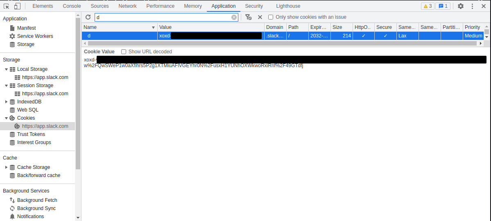
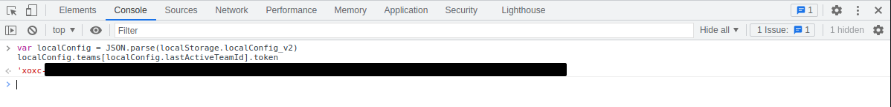
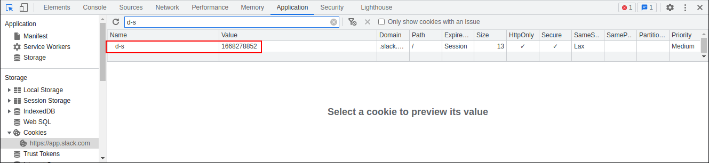

# Slack-Slurp

Slack-Slurp is a pentesting/post-exploitation tool for Slack. It uses Slack's API to search through messages, files, users, and channels, and uses [TruffleHog's](https://github.com/trufflesecurity/trufflehog) secret detectors to find exposed credentials and sensitive data.

It can be used as a CLI tool or via its built-in web dashboard.

Licensed under the [GNU Affero General Public License v3.0](LICENSE).

## Authentication

Since `slack-slurp` uses Slack's API, authentication tokens are required. Two tokens are needed when using stolen user credentials. Only one token is required for a bot token, though some features may be limited depending on the bot's permissions.

### As a normal user

The first token is the value of the `d` cookie, which starts with `xoxd-`. This cookie is HTTPOnly so it must be retrieved manually. Log in to Slack in a browser, then find the `d` cookie in the browser's developer tools.



The second token is the workspace API token, which starts with `xoxc-`. Retrieve it by running the following in the browser console:
```js
var localConfig = JSON.parse(localStorage.localConfig_v2)
localConfig.teams[localConfig.lastActiveTeamId].token
```



#### Troubleshooting

If you encounter authentication issues, you may also need the `d-s` cookie value:



This is a timestamp value tied to the `d` cookie and is only sometimes required.

### As a bot

Only the bot token (starting with `xoxb-`) is required. Functionality may be limited depending on the bot's assigned scopes.

---

## Enterprise Slack Warning

If the target Slack tenant is running **Slack Enterprise Grid**, exercise extreme caution. Enterprise deployments have enhanced security monitoring and audit logging that standard workspaces do not.

If Slack detects activity it considers suspicious, the consequences can be immediate and severe:
- The compromised user account will be **logged out of all sessions**
- The user will receive an **email notification** about the suspicious activity
- Slack workspace **admins will be alerted** via Slack messages and/or email

Some features may also behave differently or fail entirely on Enterprise tenants. For example, enterprise users are often restricted from listing channels, which means channel names may not resolve in search results.

---

## Web Dashboard

The web dashboard provides a graphical interface for all of `slack-slurp`'s functionality.

### Starting the server

```
slack-slurp server
slack-slurp server -p 9000   # custom port (default: 8000)
```

Then open `http://localhost:8000` in a browser.

### Features

#### Profiles
Manage multiple sets of Slack credentials. Each profile stores an API token, `d` cookie, and optional `d-s` cookie. Switch the active profile at any time without restarting the server.

#### Search
Search Slack messages and/or files in real time.
- Choose to search messages, files, or both simultaneously
- Filter by channel, user, and date range
- Specify file types when searching files
- Results stream in via WebSocket as they are found
- Filter displayed results by content, user, channel, or file type
- Stop a search mid-run
- Export results to JSON

#### Secrets Scan
Scan messages for secrets using TruffleHog detectors.
- Select which built-in and custom detectors to use
- Filter scope by channel, user, and date range
- Optional secret verification against live services
- Show only verified secrets
- Mark individual findings as false positives
- Hide/show false positives
- Stop a scan mid-run
- Export all findings or only non-false-positive findings to JSON

#### Channels
Browse all channels accessible to the active profile, including public channels, private channels, direct messages, and group messages.

#### Users
Browse all users in the workspace.

#### Domains
Search for messages containing configured domain patterns and extract matching domain/subdomain references.

#### URLs
Extract all URLs found in Slack messages.

#### Settings
Three-tab settings panel:

- **Profiles** — Create, edit, and delete authentication profiles
- **Custom Detectors** — Create, edit, and delete custom secret detectors using keywords and regex patterns
- **Global Search Options** — Configure the number of concurrent goroutines used during searches (default: 10)

---

## CLI

### Installation

Requires Go 1.19+:
```
go install github.com/NoF0rte/slack-slurp@latest
```

### Config

> **Note:** The config file is only needed when using `slack-slurp` as a CLI tool. When using the web dashboard, credentials and settings are managed through the Settings page instead.

The `.slack-slurp.yaml` config file holds credentials and default settings for CLI usage:
```yaml
api-token: ""
d-cookie: ""
ds-cookie: ""
detectors:
    - aws
    - azure
    - github
    - github_old
    - githubapp
    - gitlab
    - gitlabv2
    - generic
    - privatekey
    - slack
    - slackwebhook
    # ... (see Detectors section for the full list)
custom-detectors: []
domains: []
```
- **`api-token`**: Either the user or bot token. User tokens start with `xoxc-` and bot tokens start with `xoxb-`.
- **`d-cookie`**: The value of the `d` cookie when logged into the Slack web interface. Not required when the `api-token` is a bot token.
- **`ds-cookie`**: The value of the `d-s` cookie when logged into the Slack web interface. This seems to be a timestamp value for the `d` cookie and is only sometimes needed. Not required when the `api-token` is a bot token.
- **`detectors`**: A list of trufflehog detectors to use when slurping secrets from Slack. Refer to [Trufflehog Detectors](#trufflehog-detectors) for which detectors `slack-slurp` supports.
- **`custom-detectors`**: A list of custom detectors to use when slurping secrets from Slack. Refer to [Custom Detectors](#custom-detectors) for more information.
- **`domains`**: A list of domains/subdomains used to slurp domains from Slack. For example, if `example.com` was in the list of domains, Slack would be searched for any messages that contained `example.com` and any subdomains.

To create a default config file, run the following:
```
slack-slurp config -s
```
This creates the `.slack-slurp.yaml` config file with default values in the current directory.

### Usage
```
$ slack-slurp --help

Slurp juicy slack related info

Usage:
  slack-slurp [command]

Available Commands:
  channels    Returns channels accessible to the current user. This can include public/private channels and group/direct messages
  completion  Generate the autocompletion script for the specified shell
  config      Display config information
  domains     Slurp domains
  help        Help about any command
  search      Search slack messages
  secrets     Slurp secrets
  users       Slurp users
  whoami      Test credentials

Flags:
      --config string      config file (default is $HOME/.slack-slurp.yaml)
  -c, --cookie string      Slack d cookie. The token should start with xoxd. This is not needed if authenticated as a bot.
      --ds-cookie string   Slack d-s cookie. This is not needed if authenticated as a bot.
  -h, --help               help for slack-slurp
      --threads int        Number of threads to use (default 10)
  -t, --token string       Slack API token. The token should start with xoxc if authenticating as a normal user or xoxb if authenticating as a bot.

Use "slack-slurp [command] --help" for more information about a command.
```

#### Whoami
The `whoami` command will simply test the provided credentials (token, `d` cookie and `d-s` cookie). 

If successful, the command will display the current user's name
```
$ slack-slurp whoami

[+] Current user: example.user
```

If unsuccessful, `invalid_auth` is displayed

#### Channels
The `channels` command returns channels accessible to the current user. This can include public/private channels and group/direct messages. By default, it will return public/private channels and group/direct messages. The output is saved into a `slurp-channels.json` file but can be changed.

To output to the console:
```
slack-slurp channels -o -
```

To get only private channels:
```
slack-slurp channels -T private
```

To get direct and group messages:
```
slack-slurp channels -T direct -T group
```

#### Domains

#### Search
#### Secrets
#### Users

| Field | Description |
|-------|-------------|
| `api-token` | User token (`xoxc-`) or bot token (`xoxb-`) |
| `d-cookie` | Value of the `d` cookie. Not required for bot tokens. |
| `ds-cookie` | Value of the `d-s` cookie. Sometimes required for user auth. |
| `detectors` | TruffleHog detectors to use for secret scanning. See [Detectors](#detectors). |
| `custom-detectors` | Custom regex-based detectors. See [Custom Detectors](#custom-detectors). |
| `domains` | Domain patterns for the `domains` command. |

Generate a default config file:
```
slack-slurp config -s
```

### Global flags

```
--config string      Config file path (default: $HOME/.slack-slurp.yaml)
-c, --cookie string      Slack d cookie (xoxd-...)
    --ds-cookie string   Slack d-s cookie
-t, --token string       Slack API token (xoxc-... or xoxb-...)
    --threads int        Number of concurrent threads (default: 10)
```

### Commands

#### `whoami`
Test credentials and display the current user.
```
$ slack-slurp whoami
[+] Current user: example.user
```

#### `channels`
List channels accessible to the current user. Includes public/private channels and direct/group messages by default. Output is saved to `slurp-channels.json`.

```
# Print to stdout instead of file
slack-slurp channels -o -

# Only private channels
slack-slurp channels -T private

# Direct messages and group messages only
slack-slurp channels -T direct -T group
```

Flags:
```
-T, --type strings    Channel types to return: public, private, direct, group
-o, --output string   Output file (default: slurp-channels.json)
```

#### `search messages`
Search Slack messages matching a query.
```
slack-slurp search messages "password"
slack-slurp search messages "api_key" -C general -C dev
slack-slurp search messages "secret" --after 2024-01-01 --before 2024-06-01
```

#### `search files`
Search Slack files matching a query.
```
slack-slurp search files "credentials"
slack-slurp search files "config" -f pdf -f txt
```

Flags:
```
-f, --file-types strings   File types to filter by
```

#### `search`
Run both message and file searches for a query simultaneously.
```
slack-slurp search "password"
```

Shared search flags (available on `search`, `search messages`, `search files`):
```
-C, --channels strings   Limit search to specific channels
-U, --users strings      Limit search to specific users (by username)
    --before string      Only return results before this date (YYYY-MM-DD)
    --after string       Only return results after this date (YYYY-MM-DD)
```

#### `secrets`
Scan Slack messages for secrets using TruffleHog detectors. Results are written to `slurp-secrets.json` and printed to stdout.
```
slack-slurp secrets
slack-slurp secrets -V                          # verify found secrets
slack-slurp secrets --verified                  # only output verified secrets
slack-slurp secrets -d aws -d github            # use specific detectors
slack-slurp secrets -C general -C engineering   # limit to specific channels
```

Flags:
```
-o, --output string      Output file (default: slurp-secrets.json)
-V, --verify             Verify found secrets against live services
    --verified           Only output verified secrets (implies -V)
-d, --detectors strings  Detectors to use (overrides config file)
-C, --channels strings   Limit scan to specific channels
```

#### `users`
Fetch all workspace users and write to `slurp-users.json`.
```
slack-slurp users
slack-slurp users -o my-users.json
```

Flags:
```
-o, --output string   Output file (default: slurp-users.json)
```

#### `domains`
Search messages for references to configured domain patterns and output matching results to `slurp-domains.txt`.
```
slack-slurp domains
slack-slurp domains -d example.com -d .internal
slack-slurp domains --after 2024-01-01 -C engineering
```

Flags:
```
-o, --output string      Output file (default: slurp-domains.txt)
-d, --domains strings    Domains/subdomains to search for (overrides config file)
-C, --channels strings   Limit search to specific channels
-U, --users strings      Limit search to specific users
    --before string      Only return results before this date (YYYY-MM-DD)
    --after string       Only return results after this date (YYYY-MM-DD)
```

#### `urls`
Extract all URLs found in Slack messages and write to `slurp-urls.txt`.
```
slack-slurp urls
slack-slurp urls -C general --after 2024-01-01
```

Flags:
```
-o, --output string      Output file (default: slurp-urls.txt)
-C, --channels strings   Limit search to specific channels
-U, --users strings      Limit search to specific users
    --before string      Only return results before this date (YYYY-MM-DD)
    --after string       Only return results after this date (YYYY-MM-DD)
```

#### `server`
Start the web dashboard server.
```
slack-slurp server
slack-slurp server -p 9000
```

Flags:
```
-p, --port string   Port to listen on (default: 8000)
```

#### `config`
Display current config values.
```
slack-slurp config
slack-slurp config -s   # save default config to .slack-slurp.yaml
```

---

## Detectors

`slack-slurp` uses TruffleHog's [detectors](https://github.com/trufflesecurity/trufflehog/tree/main/pkg/detectors) for secret scanning. The following built-in detectors are supported:

- `auth0managementapitoken`
- `aws`
- `azure`
- `censys`
- `cloudflareapitoken`
- `cloudflarecakey`
- `digitaloceantoken`
- `discordbottoken`
- `discordwebhook`
- `dropbox`
- `gcp`
- `generic`
- `github`
- `github_old`
- `githubapp`
- `gitlab`
- `gitlabv2`
- `heroku`
- `jiratoken`
- `microsoftteamswebhook`
- `okta`
- `pastebin`
- `privatekey`
- `shodankey`
- `slack`
- `slackwebhook`
- `terraformcloudpersonaltoken`
- `uri`

### Custom Detectors

Custom detectors can be defined in the config file (for CLI use) or via the Settings page in the web dashboard. Each detector requires a name, one or more keywords, and one or more regex patterns:

```yaml
custom-detectors:
  - name: "Custom Detector"
    keywords:
      - pass
      - api
    patterns:
      - password\s*=\s*(.*)$
      - api_key\s*=\s*(.*)$
```

Slack messages are first filtered by keyword before the regex patterns are applied.

---

## Known Issues

- **Duplicate secret results** — The secrets scanner may return duplicate findings for the same secret across different messages.
- **Slack mention tags in secret matches** — Slack user mentions (`@SLACK_ID|username`) can appear inside matched secret strings, producing false or malformed results.
- **Channel IDs missing from search output** — Message and file search results do not currently include the channel ID. This is a problem on Enterprise tenants where listing channels is restricted and channel names cannot be resolved.
