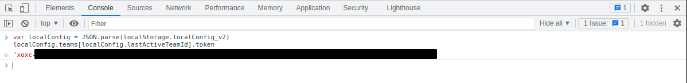

# Slack-Slurp
What is slack-slurp? Slack-slurp is a pentesting social post-exploitation tool for slack. It uses Slack's API to search through messages and [trufflehog's](https://github.com/trufflesecurity/trufflehog) secrets detectors to slurp up any juicy information. This is a work in progress and more is surely to come. Features, bug reports, and pull requests and very much welcome! I am a better coder than I am documenter so I apologize for the lack of documentation.

## Authentication
Since `slack-slurp` mainly uses Slack's API, authentication tokens are required to use the tool. If a normal user's credentials or session were stolen, two tokens are required. Only one token is required if a slack bot token was retrieved, though the tool might not fully work depending on the permissions of the token.

### As a normal user
The first required token for authenticating as a normal user is the value of the `d` cookie which starts with `xoxd-`. This cookie is set to HTTPOnly so the cookie must be retrieved manually. Log in to Slack using a web browser, then search for the `d` cookie using the browser's developer tools.


The second required token is what I am calling the workspace API token which starts with `xoxc-`. To get this token, run the following JavaScript in the web browser's console window
```
var localConfig = JSON.parse(localStorage.localConfig_v2)
localConfig.teams[localConfig.lastActiveTeamId].token
```



### As a bot
The only thing required to authenticate as a bot is the bot API token with starts with `xoxb-`. Depending on the scopes assigned to the bot, `slack-slurp` may not work.

## Trufflehog Detectors
To have pretty robust secret slurping, I opted to use trufflehog's [detectors](https://github.com/trufflesecurity/trufflehog/tree/main/pkg/detectors). There are a myriad of secret detectors used within trufflehog. These are well tested, offer ways to verify the found secrets, and cover a very wide range of commonly used services. Currently only the following detectors are supported within `slack-slurp`:

- auth0managementapitoken
- aws
- azure
- censys
- cloudflareapitoken
- cloudflarecakey
- digitaloceantoken
- discordbottoken
- discordwebhook
- dropbox
- gcp
- generic
- github
- github_old
- githubapp
- gitlab
- gitlabv2
- heroku
- jiratoken
- microsoftteamswebhook
- okta
- pastebin
- privatekey
- shodankey
- slack
- slackwebhook
- terraformcloudpersonaltoken
- uri

### Custom Detectors
Custom secret detectors can be added to the config file. The custom detectors just require a name, a keyword list, and regex patterns and look like the following:
```yaml
custom-detectors:
  - name: "Custom Detector"
    keywords:
      - pass
      - api
    patterns:
      - password\s*=\s*(.*)$
      - api_key\s*=\s*(.*)$
```

## CLI
### Installation
The `slack-slurp` CLI requires go1.19+ to install successfully. Run the following command to install the CLI:
```
go install github.com/NoF0rte/slack-slurp@latest
```
### Usage
TODO: Add usage
```
$ slack-slurp --help

Slurp juicy slack related info

Usage:
  slack-slurp [command]

Available Commands:
  channels    Returns channels accessible to the current user. This can include public/private channels and group/direct messages
  completion  Generate the autocompletion script for the specified shell
  config      Display config information
  domains     Slurp domains
  help        Help about any command
  search      Search slack messages
  secrets     Slurp secrets
  users       Slurp users
  whoami      Test credentials

Flags:
      --config string   config file (default is $HOME/.slack-slurp.yaml)
  -c, --cookie string   Slack d cookie. The token should start with xoxd. This is not needed if authenticated is a bot.
  -h, --help            help for slack-slurp
      --threads int     Number of threads to use (default 10)
  -t, --token string    Slack API token. The token should start with xoxc if authenticating as a normal user or xoxb if authenticating as a bot.

Use "slack-slurp [command] --help" for more information about a command.
```
#### Default Config
The `.slack-slurp.yaml` config file contains the various configurable settings for `slack-slurp`
```yaml
api-token: ""
d-cookie: ""
ds-cookie: ""
detectors:
    - auth0managementapitoken
    - aws
    - azure
    - censys
    - cloudflareapitoken
    - cloudflarecakey
    - digitaloceantoken
    - discordbottoken
    - discordwebhook
    - dropbox
    - gcp
    - generic
    - github
    - github_old
    - githubapp
    - gitlab
    - gitlabv2
    - heroku
    - jiratoken
    - microsoftteamswebhook
    - okta
    - pastebin
    - privatekey
    - shodankey
    - slack
    - slackwebhook
    - terraformcloudpersonaltoken
    - uri
custom-detectors: []
domains: []
```
Create a default config file by running the following:
```
slack-slurp config -s
```

## Library
### Installation
Run the following command to install the module in your application:
```
go get github.com/NoF0rte/slack-slurp@latest
```
Then use the following to import it:
```golang
import "github.com/NoF0rte/slack-slurp/pkg/slurp"
```
### Slurp Client
To create a slurp client (slurper), only the authentication tokens are required
```golang
cfg := slurp.Config{
    APIToken:  "xoxc-xxxxxxx",
    DCookie: "xoxd-xxxxxxx",
}

slurper = slurp.New(&cfg)
```
Optionally the default domains to slurp and secret detectors can be set via:
```golang
cfg := slurp.Config{
    APIToken:  "xoxc-xxxxxxx",
    DCookie: "xoxd-xxxxxxx",
    Domains: []string{
        "company.com",
        ".local",
    },
    Detectors: []string{
        "aws",
        "generic",
        "github",
        "github_old",
        "githubapp",
        "gitlab",
        "gitlabv2",
        "heroku",
        "jiratoken",
        "microsoftteamswebhook",
        "okta",
    }
}

slurper = slurp.New(&cfg)
```

### Searching
#### Messages
To search Slack messages, the `SearchMessages(query)` and `SearchMessagesAsync(query)` methods can be used. The `SearchMessages` method will only return all messages containing the query once all results have been retrieved.

```golang
messages, err := slurper.SearchMessages("my first query")
if err != nil {
    panic(err)
}

for _, message := range messages {
    fmt.Println(message)
}
```
The `SearchMessagesAsync` method is the same as `SearchMessages` except it sends each message as it is found through the returned channel.
```golang
messageChan, errorChan := slurper.SearchMessagesAsync("my first query")

Loop:
for {
    select {
    case message, ok := <-messageChan:
        if !ok {
            break Loop
        }

        fmt.Println(message)

    case err = <-errorChan:
        close(messageChan)
    }
}
close(errorChan)
```
#### Files

### Get Channels

### Get Users

### Slurp Secrets

### Slurp Domains

